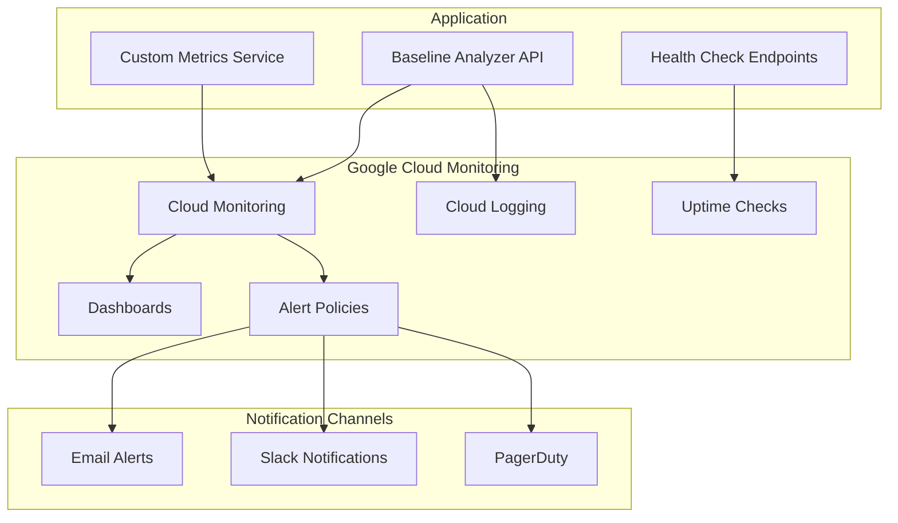

# Production Monitoring and Alerting

This document describes the comprehensive monitoring and alerting setup for the Baseline Analyzer application in production.

## Overview

The monitoring system provides:

- **Real-time dashboards** for application and infrastructure metrics
- **Proactive alerting** for critical issues and performance degradation
- **Health checks** for service availability monitoring
- **Custom metrics** for business logic and application-specific monitoring
- **Structured logging** for debugging and audit trails
- **Log-based metrics** for advanced monitoring scenarios

## Architecture



## Health Check Endpoints

### `/api/health`
Basic health check that returns service status and basic metrics.

**Response Format:**
```json
{
  "status": "healthy|degraded|unhealthy",
  "timestamp": "2024-01-01T12:00:00Z",
  "version": "1.0.0",
  "environment": "production",
  "uptime": 3600,
  "memory": {
    "rss": 123456789,
    "heapTotal": 98765432,
    "heapUsed": 87654321,
    "external": 12345678
  },
  "checks": {
    "database": "healthy|unhealthy",
    "redis": "healthy|unhealthy",
    "external_services": "healthy|degraded|unhealthy"
  },
  "response_time_ms": 45
}
```

### `/api/health/ready`
Readiness check for Kubernetes-style health monitoring.

**Response Format:**
```json
{
  "status": "ready|not_ready",
  "timestamp": "2024-01-01T12:00:00Z",
  "checks": {
    "database": true,
    "migrations": true,
    "secrets": true,
    "dependencies": true
  },
  "response_time_ms": 23
}
```

### `/api/health/metrics`
Application metrics endpoint for monitoring systems.

**Response Format:**
```json
{
  "timestamp": "2024-01-01T12:00:00Z",
  "application": {
    "name": "baseline-analyzer",
    "version": "1.0.0",
    "environment": "production",
    "uptime_seconds": 3600,
    "memory_usage": {...},
    "cpu_usage": {...}
  },
  "business_metrics": {
    "total_users": 1234,
    "total_organizations": 56,
    "total_analyses": 7890,
    "analyses_last_24h": 123,
    "active_users_last_24h": 45,
    "credit_transactions_last_24h": 67
  },
  "performance_metrics": {
    "avg_analysis_time_ms": 45000,
    "avg_response_time_ms": 250,
    "error_rate_last_hour": 0.02
  }
}
```

## Monitoring Dashboard

The production dashboard includes the following widgets:

### Infrastructure Metrics
- **Request Count**: Cloud Run request rate over time
- **Response Latency**: 95th percentile response times
- **Error Rate**: HTTP error responses per second
- **Memory Utilization**: Container memory usage percentage
- **CPU Utilization**: Container CPU usage percentage
- **Database Connections**: Active PostgreSQL connections

### Business Metrics
- **Analyses Completed**: Rate of successful repository analyses
- **Credit Transactions**: Credit purchase and usage events
- **Active Users**: Users active in the last 24 hours
- **AI Provider Usage**: Distribution of AI provider usage

### Performance Metrics
- **Analysis Duration**: Average time to complete analyses
- **Database Query Performance**: Slow query detection
- **Cache Hit Rates**: Redis cache performance (if applicable)

## Alert Policies

### Critical Alerts (PagerDuty)

#### Service Unavailable
- **Condition**: Health check fails for 3 minutes
- **Threshold**: Uptime check success rate < 100%
- **Duration**: 180 seconds
- **Action**: Immediate PagerDuty notification

#### High Error Rate
- **Condition**: HTTP error rate > 5%
- **Threshold**: Error responses / total responses > 0.05
- **Duration**: 300 seconds
- **Action**: PagerDuty + Slack notification

#### Database Connection Failure
- **Condition**: Database health check fails
- **Threshold**: Database connections unavailable
- **Duration**: 60 seconds
- **Action**: Immediate PagerDuty notification

### Warning Alerts (Slack + Email)

#### High Response Latency
- **Condition**: 95th percentile latency > 5 seconds
- **Threshold**: Response time > 5000ms
- **Duration**: 300 seconds
- **Action**: Slack + Email notification

#### High Memory Usage
- **Condition**: Memory utilization > 85%
- **Threshold**: Memory usage > 0.85
- **Duration**: 600 seconds
- **Action**: Slack + Email notification

#### High CPU Usage
- **Condition**: CPU utilization > 80%
- **Threshold**: CPU usage > 0.80
- **Duration**: 600 seconds
- **Action**: Slack + Email notification

#### AI Provider Failures
- **Condition**: AI provider error rate > 10 errors/5min
- **Threshold**: AI provider errors > 10
- **Duration**: 300 seconds
- **Action**: Slack + Email notification

#### Payment Processing Failures
- **Condition**: Payment failure rate > 5 failures/5min
- **Threshold**: Payment failures > 5
- **Duration**: 300 seconds
- **Action**: Slack + Email notification

### Business Logic Alerts

#### Low System Credit Balance
- **Condition**: System credit balance < 1000 credits
- **Threshold**: Available credits < 1000
- **Duration**: 300 seconds
- **Action**: Email notification to admin

#### Analysis Queue Backup
- **Condition**: Pending analyses > 50
- **Threshold**: Queue depth > 50
- **Duration**: 600 seconds
- **Action**: Slack notification

## Custom Metrics

### Business Metrics
- `baseline_analyzer/analyses_completed`: Count of completed analyses
- `baseline_analyzer/analyses_in_progress`: Current analyses being processed
- `baseline_analyzer/active_users`: Users active in last 24h
- `baseline_analyzer/credit_transactions`: Credit transaction events
- `baseline_analyzer/system_credit_balance`: Available system credits

### Performance Metrics
- `baseline_analyzer/analysis_duration_ms`: Time to complete analyses
- `baseline_analyzer/ai_provider_response_time_ms`: AI API response times
- `baseline_analyzer/database_operation_duration_ms`: Database query times
- `baseline_analyzer/memory_heap_used_bytes`: Application memory usage
- `baseline_analyzer/cpu_user_microseconds`: CPU usage metrics

### Error Metrics
- `baseline_analyzer/error_rate`: Application error rate
- `baseline_analyzer/ai_provider_errors`: AI provider API failures
- `baseline_analyzer/database_errors`: Database operation failures
- `baseline_analyzer/payment_failures`: Payment processing failures

## Structured Logging

### Log Levels
- **DEBUG**: Detailed debugging information
- **INFO**: General application flow information
- **WARNING**: Unexpected but recoverable conditions
- **ERROR**: Error conditions that don't stop the application
- **CRITICAL**: Serious errors that may stop the application

### Event Types
- `analysis_started`: Repository analysis initiated
- `analysis_completed`: Repository analysis finished successfully
- `analysis_failed`: Repository analysis failed
- `credit_transaction`: Credit purchase, deduction, or refund
- `user_registration`: New user account created
- `user_login`: User authentication event
- `payment_processed`: Payment transaction completed
- `ai_provider_error`: AI provider API call failed
- `database_error`: Database operation failed
- `authentication_failure`: Login attempt failed
- `authorization_failure`: Access denied
- `rate_limit_exceeded`: Rate limit threshold reached
- `slow_query`: Database query exceeded time threshold

### Required Log Fields
```json
{
  "timestamp": "2024-01-01T12:00:00Z",
  "level": "INFO|WARNING|ERROR|CRITICAL",
  "message": "Human-readable message",
  "service": "baseline-analyzer",
  "version": "1.0.0",
  "trace_id": "unique-trace-id",
  "user_id": "user-identifier",
  "organization_id": "org-identifier",
  "event_type": "analysis_completed",
  "additional_context": {...}
}
```

## Log-Based Metrics

### Error Rate Tracking
```
resource.type="cloud_run_revision"
AND resource.labels.service_name="baseline-analyzer-api"
AND severity="ERROR"
```

### Business Event Tracking
```
resource.type="cloud_run_revision"
AND resource.labels.service_name="baseline-analyzer-api"
AND jsonPayload.event_type="analysis_completed"
```

### Security Event Tracking
```
resource.type="cloud_run_revision"
AND resource.labels.service_name="baseline-analyzer-api"
AND jsonPayload.event_type="authentication_failure"
```

## Setup Instructions

### 1. Run Monitoring Setup Script

```bash
# Set required environment variables
export GOOGLE_CLOUD_PROJECT="your-project-id"
export ALERT_EMAIL="alerts@your-domain.com"
export SLACK_WEBHOOK="https://hooks.slack.com/services/YOUR/SLACK/WEBHOOK"

# Run the setup script
cd baseline-analyzer
chmod +x scripts/setup-monitoring.sh
./scripts/setup-monitoring.sh
```

### 2. Configure Notification Channels

#### Email Notifications
```bash
gcloud alpha monitoring channels create \
  --display-name="Production Alerts Email" \
  --type=email \
  --channel-labels=email_address=alerts@your-domain.com
```

#### Slack Notifications
```bash
gcloud alpha monitoring channels create \
  --display-name="Production Alerts Slack" \
  --type=slack \
  --channel-labels=url=https://hooks.slack.com/services/YOUR/SLACK/WEBHOOK
```

#### PagerDuty Integration
```bash
gcloud alpha monitoring channels create \
  --display-name="Production Critical Alerts PagerDuty" \
  --type=pagerduty \
  --channel-labels=service_key=YOUR_PAGERDUTY_SERVICE_KEY
```

### 3. Verify Setup

```bash
# Check dashboard creation
gcloud monitoring dashboards list

# Check alert policies
gcloud alpha monitoring policies list

# Check uptime checks
gcloud monitoring uptime list

# Test health endpoints
curl https://your-api-url/api/health
curl https://your-api-url/api/health/ready
curl https://your-api-url/api/health/metrics
```

## Troubleshooting

### Common Issues

1. **Metrics Not Appearing**
   - Verify Cloud Monitoring API is enabled
   - Check service account permissions
   - Ensure custom metrics are being written correctly

2. **Alerts Not Firing**
   - Verify notification channels are configured
   - Check alert policy conditions and thresholds
   - Ensure metrics are being generated

3. **Health Checks Failing**
   - Verify endpoints are accessible
   - Check firewall rules and VPC configuration
   - Ensure service is running and healthy

### Useful Commands

```bash
# View recent logs
gcloud logging read 'resource.type="cloud_run_revision"' --limit=50

# List custom metrics
gcloud monitoring metrics list --filter="metric.type:custom.googleapis.com/baseline_analyzer"

# Test alert policy
gcloud alpha monitoring policies list --filter="displayName:'Baseline Analyzer - High Error Rate'"

# Check uptime check status
gcloud monitoring uptime list --filter="displayName:'Baseline Analyzer API Health Check'"
```

## Performance Optimization

### Monitoring Performance Impact
- Custom metrics are written asynchronously to avoid blocking requests
- Health check endpoints are optimized for fast response times
- Log structured data to enable efficient querying and alerting

### Cost Optimization
- Use appropriate log retention periods
- Configure log sinks to export only necessary data
- Set up log-based metrics instead of custom metrics where possible
- Use sampling for high-volume debug logs

## Security Considerations

### Sensitive Data in Logs
- Never log passwords, API keys, or other secrets
- Redact PII from log messages
- Use structured logging to control what gets logged

### Access Control
- Restrict access to monitoring dashboards and logs
- Use IAM roles to control who can view and modify monitoring configuration
- Enable audit logging for monitoring configuration changes

## Next Steps

After setting up monitoring:

1. **Configure Security and Compliance** (Task 22.3)
2. **Set up automated testing** against production environment
3. **Create runbooks** for common alert scenarios
4. **Implement log analysis** and anomaly detection
5. **Set up capacity planning** based on metrics trends